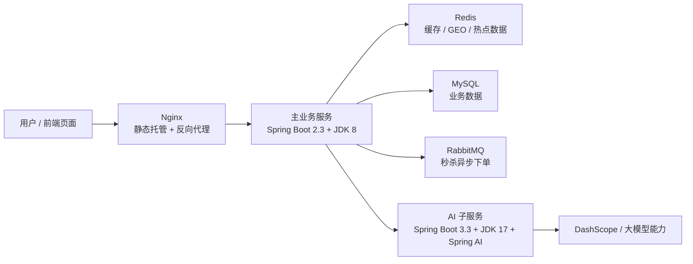
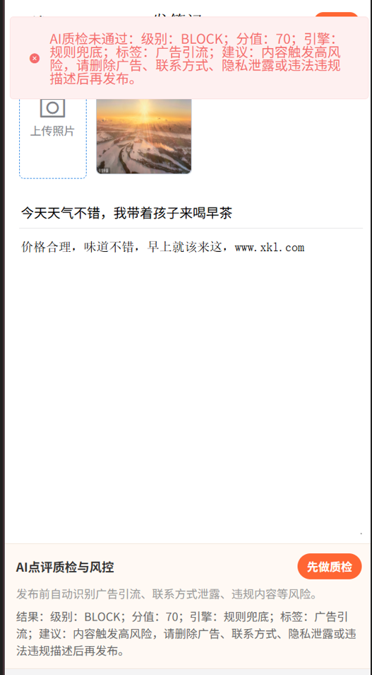
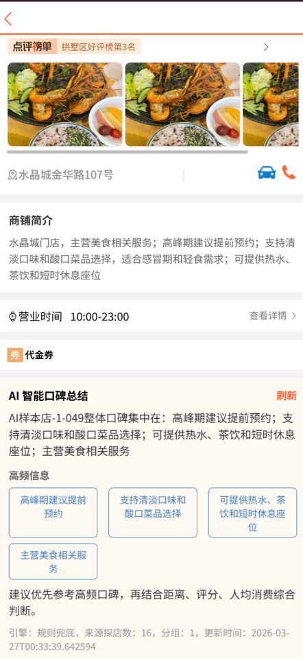

<!-- github-markdown.md -->

<div align="center">

# 黑马点评 大模型（AI）升级版

<p>
  基于原始黑马点评项目的 AI 升级改造版。<br/>
  保留本地生活核心业务能力，同时引入独立 Sidecar AI 子服务，实现更清晰的架构边界与更灵活的模型接入方式。
</p>


<p>
  
  
  
  
  
</p>

<p>
  
  
  
  
</p>

</div>

---

## 项目简介
一个基于黑马点评项目的 AI 升级实践：用 Sidecar 架构把店铺总结、智能推荐与评论风控三类大模型能力接入业务链路。

这是一个在原始黑马点评项目基础上完成的 AI 改造版仓库。

项目保留了原有的本地生活业务能力，同时新增了 3 个大模型功能，并将 AI 能力拆分为独立 Sidecar 服务，避免直接侵入主项目技术底座，在兼顾稳定性的同时提升可扩展性。
（如果可以的话，可以给个star（小星星）吗？😻😻😻🥰🥰🥰

当前仓库同时包含：

1. 主业务后端：`dianping-nginx-1.18.0`
2. 前端静态页面：`dianping-nginx-1.18.0/nginx-1.18.0 dianping/html/hmdp`
3. AI 子服务：`hmdp-ai-service`
4. 一键初始化数据库脚本：`sql/open-source-full-init.sql`
5. 面试深度拆解文档：`myself-readme.md`

---

## 项目亮点

<table>
  <tr>
    <td width="50%">
      <strong>AI 能力独立部署</strong><br/>
      AI 逻辑拆为 Sidecar 服务，避免直接改动主业务基础框架。
    </td>
    <td width="50%">
      <strong>兼容旧底座</strong><br/>
      主项目继续使用 Spring Boot 2.3 + JDK 8，稳定优先。
    </td>
  </tr>
  <tr>
    <td width="50%">
      <strong>三大 AI 场景</strong><br/>
      店铺口碑总结、点评助手、评论质检与风控。
    </td>
    <td width="50%">
      <strong>双层兜底设计</strong><br/>
      模型失败时，主服务与 AI 服务都可回退到本地规则。
    </td>
  </tr>
  <tr>
    <td width="50%">
      <strong>缓存策略完整</strong><br/>
      分组总结缓存、总结缓存、指纹缓存、推荐结果缓存。
    </td>
    <td width="50%">
      <strong>原业务链路保留</strong><br/>
      秒杀链路继续采用 RabbitMQ 异步下单方案。
    </td>
  </tr>
</table>

---

## AI 改造点

在原项目基础上，本仓库重点新增了以下能力：

1. AI 店铺口碑总结
2. AI 点评助手（结合 5km 范围、店铺简介、口碑与距离做推荐）
3. AI 点评质检与风控（广告引流、联系方式、隐私泄露、违法违禁、人身攻击等）
4. `tb_shop.shop_desc` 商铺简介字段，用于承载大模型可理解的经营信息
5. Redis 缓存、分组总结、模型失败兜底、指纹缓存、推荐结果缓存
6. 秒杀链路保留 RabbitMQ 异步下单方案

---

## 架构设计

本项目没有把大模型逻辑直接塞进主业务服务，而是做成了一个独立的 Sidecar：

- 主业务服务负责数据检索、Redis 缓存、GEO 搜索、业务规则、接口编排
- AI 子服务负责意图识别、总结、重排、推荐理由生成、风控判断
- 主业务服务通过 HTTP 调用 AI 子服务

这样设计的原因很直接：

1. 主项目仍然是 `Spring Boot 2.3 + JDK 8`，稳定优先
2. AI 子服务单独使用 `Spring Boot 3.3 + JDK 17 + Spring AI`
3. 大模型供应商可以独立切换，不影响主业务
4. 当模型超时或不可用时，可以在主服务和 AI 服务两侧同时兜底

当前 AI 子服务默认使用 DashScope 模型，代码里已经改成环境变量读取，不再把真实 API Key 提交到仓库。



---

## 仓库结构

```text
.
├─ README.md
├─ myself-readme.md
├─ sql/
│  └─ open-source-full-init.sql
├─ dianping-nginx-1.18.0/
│  ├─ pom.xml
│  ├─ src/main/java/com/hmdp
│  ├─ src/main/resources/application.yaml
│  ├─ src/main/resources/db/hmdp.sql
│  └─ nginx-1.18.0 dianping/
│     ├─ conf/nginx.conf
│     └─ html/hmdp/
└─ hmdp-ai-service/
   ├─ pom.xml
   ├─ src/main/java/com/hmdp/ai
   └─ src/main/resources/application.yaml
```

---

## 主要技术栈

### 主项目

- Spring Boot 2.3.12
- Java 8
- MyBatis-Plus
- MySQL
- Redis
- Redisson
- RabbitMQ
- Nginx 静态托管 + 反向代理

### AI 子服务

- Spring Boot 3.3.5
- Java 17
- Spring AI
- DashScope 模型接入

---

## 功能演示

<div align="center">
  <table>
    <tr>
      <td align="center">
        <strong>AI 点评助手</strong><br/><br/>
        
      </td>
      <td align="center">
        <strong>AI 店铺口碑总结</strong><br/><br/>
        
      </td>
      <td align="center">
        <strong>评论校验 / AI 风控</strong><br/><br/>
        
      </td>
    </tr>
  </table>
</div>

> 三张图片顺序分别对应：AI 点评助手、AI 店铺口碑总结、评论校验。  


---

## 三个 AI 功能

### 1. AI 店铺口碑总结

- 数据来源：`tb_blog`
- 处理方式：按店铺聚合博客，先做 `chunk summary`，再做 `final summary`
- 缓存策略：分组缓存 + 总结缓存 + 指纹校验
- 页面入口：`shop-detail.html`

### 2. AI 点评助手

- 输入：用户自然语言需求 + 当前坐标 + 当前店铺类型
- 检索：Redis GEO 优先，查不到时 DB 兜底
- 排序：本地规则粗排 + 大模型重排 + 大模型生成理由
- 关键上下文：`tb_shop.shop_desc`
- 页面入口：`shop-list.html`

### 3. AI 点评质检与风控

- 前端在发笔记页先做一次 AI 质检
- 后端 `POST /blog` 再强制做一次 AI 风控校验
- 模型不可用时走本地规则兜底
- 页面入口：`blog-edit.html`

---

## RabbitMQ 改造说明

AI 功能之外，项目里还保留了 RabbitMQ 秒杀异步下单链路：

1. 前端发起秒杀请求
2. Lua 在 Redis 中做库存和一人一单原子校验
3. 通过 RabbitMQ 投递订单消息
4. 消费者落库，结合 Redisson 锁和事务处理
5. 正常队列失败后可进入死信队列兜底消费

关键代码：

- `dianping-nginx-1.18.0/src/main/java/com/hmdp/service/impl/VoucherOrderServiceImpl.java`
- `dianping-nginx-1.18.0/src/main/java/com/hmdp/listener/SeckillVoucherListener.java`
- `dianping-nginx-1.18.0/src/main/java/com/hmdp/config/RabbitMQConfig.java`

---

## 快速启动

### 1. 环境准备

建议准备以下环境：

- JDK 8，用于主项目
- JDK 17，用于 AI 子服务
- Maven 3.9+
- MySQL 5.7+ 或 8.x
- Redis 6+
- RabbitMQ 3.x
- Nginx 1.18+

### 2. 初始化数据库

导入根目录 SQL：

```sql
sql/open-source-full-init.sql
```

这份脚本会完成：

1. 创建 `hmdp` 数据库
2. 创建原项目表结构
3. 补齐 `tb_shop.shop_desc`
4. 导入基础演示数据
5. 额外导入 30 家美食类 AI 测试店铺
6. 为这 30 家店铺生成 14 到 22 条博客样本，并提高互动量用于 AI 演示

### 3. 修改主项目配置

文件：

```text
dianping-nginx-1.18.0/src/main/resources/application.yaml
```

至少需要确认这些配置：

1. `server.port`
2. `spring.datasource.url`
3. `spring.datasource.username`
4. `spring.datasource.password`
5. `spring.redis.host`
6. `spring.redis.port`
7. `spring.redis.password`
8. `spring.rabbitmq.host`
9. `spring.rabbitmq.port`
10. `spring.rabbitmq.username`
11. `spring.rabbitmq.password`
12. `hmdp.ai.base-url`

默认情况下：

- 主后端端口：`8081`
- AI 子服务端口：`8090`

### 4. 修改 AI 子服务配置

文件：

```text
hmdp-ai-service/src/main/resources/application.yaml
```

现在已经改成环境变量读取，不需要把 Key 显式写进仓库。

Windows 示例：

```bash
set DASHSCOPE_API_KEY=你的阿里千问api-key
set DASHSCOPE_MODEL=qwen-turbo-flash
```

如果要改端口：

```bash
set HMDP_AI_PORT=8090
```

### 5. 修改图片上传目录

文件：

```text
dianping-nginx-1.18.0/src/main/java/com/hmdp/utils/SystemConstants.java
```

需要把：

```java
IMAGE_UPLOAD_DIR
```

改成你本机实际存在的 `html/hmdp/imgs` 目录路径，否则图片上传功能会写到错误目录。

### 6. 检查 Nginx 代理

文件：

```text
dianping-nginx-1.18.0/nginx-1.18.0 dianping/conf/nginx.conf
```

当前约定：

- Nginx 端口：`8080`
- `/api/**` 反向代理到 `http://127.0.0.1:8081`

前端 `common.js` 使用的是：

```javascript
axios.defaults.baseURL = "/api";
```

建议通过 Nginx 访问页面。

### 7. 启动顺序

推荐顺序如下：

1. 启动 MySQL
2. 启动 Redis
3. 启动 RabbitMQ
4. 导入 `sql/open-source-full-init.sql`
5. 启动 AI 子服务
6. 启动主后端
7. 启动 Nginx

### 8. 启动命令

AI 子服务：

```bash
cd hmdp-ai-service
mvn spring-boot:run
```

主后端：

```bash
cd dianping-nginx-1.18.0
mvn spring-boot:run
```

Nginx：

```bash
cd "dianping-nginx-1.18.0/nginx-1.18.0 dianping"
start nginx.exe
```

### 9. 访问地址

- 前端首页：`http://127.0.0.1:8080`
- 主后端：`http://127.0.0.1:8081`
- AI 子服务：`http://127.0.0.1:8090`

---

## Redis 预热说明

SQL 只能负责数据库数据，不能直接把数据写进 Redis。

不过本项目本身已经有两套方式保证 Redis 数据最终可用：

1. 业务访问时按需回填
2. 使用 `DemoDataSeedRunner` 做预热和校验

相关类：

- `dianping-nginx-1.18.0/src/main/java/com/hmdp/tools/DemoDataSeedRunner.java`
- `dianping-nginx-1.18.0/src/main/java/com/hmdp/tools/DemoDataSeedService.java`

如果你希望在导入 SQL 后把 GEO、店铺缓存等提前打进 Redis，可以直接在 IDE 里运行 `DemoDataSeedRunner`。

---

## 关键代码入口

### 主项目

- AI 控制器：`dianping-nginx-1.18.0/src/main/java/com/hmdp/controller/AiController.java`
- AI 编排核心：`dianping-nginx-1.18.0/src/main/java/com/hmdp/service/impl/AiServiceImpl.java`
- AI 子服务客户端：`dianping-nginx-1.18.0/src/main/java/com/hmdp/ai/client/AiRemoteClientImpl.java`
- Redis Key：`dianping-nginx-1.18.0/src/main/java/com/hmdp/utils/RedisConstants.java`
- 博客发布时风控拦截：`dianping-nginx-1.18.0/src/main/java/com/hmdp/controller/BlogController.java`

### AI 子服务

- 接口入口：`hmdp-ai-service/src/main/java/com/hmdp/ai/controller/InternalAiController.java`
- 提示词与兜底实现：`hmdp-ai-service/src/main/java/com/hmdp/ai/service/AiOrchestrationService.java`

### 前端

- 店铺详情 AI 总结：`dianping-nginx-1.18.0/nginx-1.18.0 dianping/html/hmdp/shop-detail.html`
- 店铺列表 AI 助手：`dianping-nginx-1.18.0/nginx-1.18.0 dianping/html/hmdp/shop-list.html`
- 发笔记 AI 风控：`dianping-nginx-1.18.0/nginx-1.18.0 dianping/html/hmdp/blog-edit.html`

---


