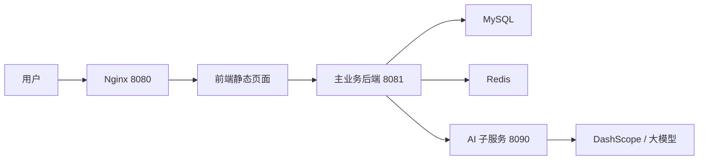
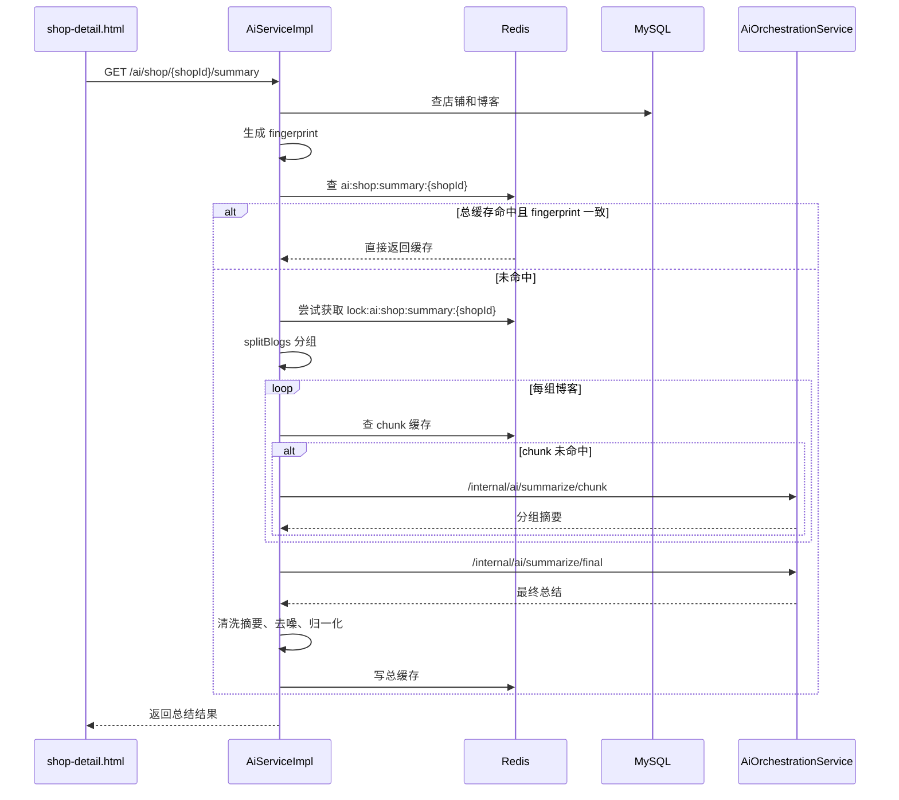
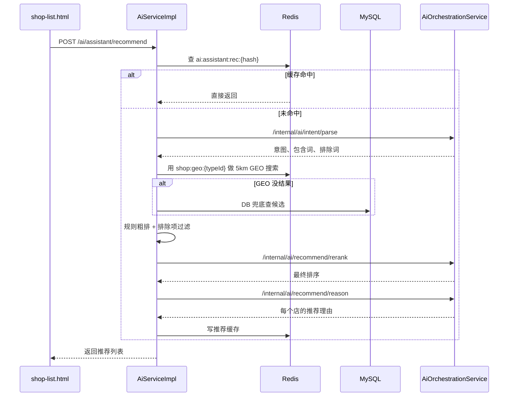
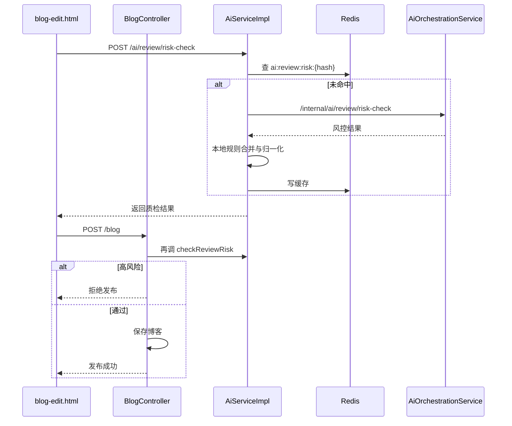

# 黑马点评 AI 改造自述文档

这份文档是给我自己讲清楚项目的，不是先背面试题，而是先把项目本身讲明白。顺序是：

1. 先理解整个项目里 AI 放在哪里
2. 再理解 3 个大模型功能分别怎么跑
3. 再看 Redis、分段总结、兜底这些优化
4. 最后再看面试问题

## 1. 先把项目讲清楚

### 1.1 这不是“前端直接调大模型”的项目

这个项目里的大模型功能，不是页面拿到用户输入后直接去调模型 API。

真实链路是：

```text
前端页面 -> 主业务后端 -> AI 子服务 -> 大模型
```

也就是说，真正直接连接大模型的是 `hmdp-ai-service`，不是前端，也不是主业务 Controller。

### 1.2 项目里一共有 3 层

#### 第 1 层：前端静态页面

位置：

- `dianping-nginx-1.18.0/nginx-1.18.0 dianping/html/hmdp`

作用：

1. 展示页面
2. 收集用户输入
3. 调后端接口

和 AI 相关的 3 个页面：

1. `shop-detail.html`
   店铺详情页，展示 AI 口碑总结
2. `shop-list.html`
   店铺列表页，展示 AI 助手推荐
3. `blog-edit.html`
   发笔记页，做 AI 质检与风控

#### 第 2 层：主业务后端

位置：

- `dianping-nginx-1.18.0/src/main/java/com/hmdp`

作用：

1. 负责业务数据查询
2. 负责 Redis 缓存
3. 负责 Redis GEO 附近店铺检索
4. 负责业务规则、排序和兜底
5. 负责调用 AI 子服务

和 AI 相关的核心文件：

1. `controller/AiController.java`
2. `service/impl/AiServiceImpl.java`
3. `ai/client/AiRemoteClientImpl.java`
4. `utils/RedisConstants.java`
5. `controller/BlogController.java`

#### 第 3 层：AI 子服务

位置：

- `hmdp-ai-service/src/main/java/com/hmdp/ai`

作用：

1. 调大模型
2. 管提示词
3. 规定 JSON 输出格式
4. 做模型失败时的本地 fallback

核心文件：

1. `controller/InternalAiController.java`
2. `service/AiOrchestrationService.java`

### 1.3 为什么要拆 AI 子服务

原因很实际：

1. 主项目是 `Spring Boot 2.3 + Java 8`
2. AI 子服务是 `Spring Boot 3.3 + Java 17`
3. 如果把大模型 SDK 直接塞进主项目，会让主项目变重、变乱、也更难换模型

所以我用的是 Sidecar 方案：

- 主业务后端做“业务编排”
- AI 子服务做“模型能力编排”

这样做的好处：

1. 主项目稳定性更好
2. AI 依赖独立
3. 模型供应商可替换
4. 主项目保留业务兜底，不会一挂全挂

### 1.4 这个项目里，大模型到底负责什么

这点一定要讲清楚，因为这 3 个功能不是“完全由 AI 单独完成”的。

大模型主要负责：

1. 分组摘要
2. 最终摘要
3. 用户意图解析
4. 推荐结果重排
5. 推荐理由生成
6. 风控判断

主业务后端主要负责：

1. 查 MySQL
2. 查 Redis
3. GEO 搜索
4. 候选召回
5. 本地规则过滤
6. 缓存读写
7. 分布式锁
8. fallback 兜底

所以这个项目的真实设计不是“AI 取代业务逻辑”，而是“AI 和业务逻辑协同”。

## 2. 整个 AI 系统的总数据流

### 2.1 总体调用关系



### 2.2 AI 相关统一链路

几乎所有 AI 功能都遵循同一个模式：

1. 前端发请求给主业务后端
2. 主业务后端先查 Redis 缓存
3. 主业务后端查 DB / GEO / 业务数据
4. 主业务后端把结构化数据发给 AI 子服务
5. AI 子服务调用大模型
6. 如果模型失败，则返回 fallback
7. 主业务后端再做一层归一化、过滤、缓存
8. 返回前端

### 2.3 Redis 在 AI 场景里做什么

Redis 不只是拿来“缓存最终答案”的。

这里一共做了几类事情：

1. 店铺总结缓存
2. 分组 chunk 缓存
3. AI 助手推荐缓存
4. 风控结果缓存
5. 店铺总结构建锁
6. 附近商铺 GEO 检索

关键 Redis Key 在：

- `dianping-nginx-1.18.0/src/main/java/com/hmdp/utils/RedisConstants.java`

主要包括：

1. `ai:shop:summary:`
2. `ai:shop:summary:chunk:`
3. `lock:ai:shop:summary:`
4. `ai:assistant:rec:`
5. `ai:review:risk:`
6. `shop:geo:`

## 3. 功能一：店铺 AI 口碑总结

### 3.1 功能目标

用户进入店铺详情页时，不想自己看很多篇探店笔记，所以我要把这个店铺相关的博客内容自动汇总成：

1. 一段整体总结
2. 高频信息
3. 小众亮点
4. 一句建议

页面入口：

- `shop-detail.html`

接口入口：

- `GET /ai/shop/{shopId}/summary`

### 3.2 这个功能的数据来源

数据来源不是评论表，而是：

- `tb_blog`

也就是把“探店博客”当作店铺口碑样本来处理。

主业务后端里查数据的位置：

- `AiServiceImpl.getShopSummary`

它会做：

1. 根据 `shopId` 查 `tb_shop`
2. 根据 `shopId` 查 `tb_blog`
3. 博客按 `liked desc, create_time desc` 排序
4. 只拿一部分高价值博客，不会无限查

### 3.3 真实执行流程



### 3.4 为什么要做“分段总结 + 最终聚合”

这是整个项目里最值得讲的优化之一。

如果一个店铺有很多博客，直接把全部博客内容一次性丢给模型，会有几个问题：

1. token 成本高
2. 响应变慢
3. 容易超过模型上下文
4. 一条博客变化就得全部重算

所以我做成了两层：

1. `chunk summarize`
   每 20 条左右博客做一次小结
2. `final summarize`
   再把每个 chunk 的结果聚合成最终总结

这个思路本质上类似 Map-Reduce：

1. 先分块提炼
2. 再全局聚合

主业务后端里对应的方法：

1. `AiServiceImpl.buildSummary`
2. `AiServiceImpl.splitBlogs`
3. `AiServiceImpl.aggregateHighFrequency`
4. `AiServiceImpl.aggregateUnique`

AI 子服务里对应的方法：

1. `AiOrchestrationService.summarizeChunk`
2. `AiOrchestrationService.summarizeFinal`

### 3.5 缓存和一致性怎么做

#### 第 1 层：总摘要缓存

Key：

- `ai:shop:summary:{shopId}`

#### 第 2 层：chunk 缓存

Key：

- `ai:shop:summary:chunk:{shopId}:{fingerprint}:{chunkIndex}`

#### 第 3 层：构建锁

Key：

- `lock:ai:shop:summary:{shopId}`

#### 第 4 层：博客变化触发失效

当博客新增时：

- `BlogServiceImpl.saveBlog`

会删除：

- `RedisConstants.AI_SHOP_SUMMARY_KEY + blog.getShopId()`

这样下次再看这个店铺时，就会重新生成摘要。

### 3.6 fingerprint 是怎么做的

关键方法：

- `AiServiceImpl.buildFingerprint`

逻辑：

1. 取每条博客的 `blogId:updateTime`
2. 拼成字符串
3. 做 MD5

只要博客新增或更新时间变化，fingerprint 就会变。

这样缓存就不是“粗暴地看有没有”，而是“看缓存是不是对应当前这批博客”。

### 3.7 模型失败怎么办

两层兜底：

#### AI 子服务 fallback

在：

- `AiOrchestrationService.fallbackChunkSummary`
- `AiOrchestrationService.fallbackFinalSummary`

这里会用本地规则把句子拆开、统计频次、拼出结构化结果。

#### 主业务后端 fallback

在：

- `AiServiceImpl.buildSummary`

如果远程调用返回不合法，会退回本地 chunk / final 聚合结果。

这保证了：

1. 模型超时不至于页面报错
2. 即使没有模型，也还能返回一个可读结果

### 3.8 噪声清洗做了什么

这个功能如果不做清洗，AI 总结很容易带出样本标题、编号或者模板句。

我做了几类处理：

1. 过滤 `AI探店-编号`
2. 过滤样本店编号
3. 过滤固定模板句
4. 过滤无意义短句
5. 过滤“门店主打xx店”这类怪句
6. 做高频/小众点去重和长度裁剪

关键位置：

- `AiServiceImpl.normalizePointList`
- `AiServiceImpl.isMeaningfulSummaryPoint`
- `AiServiceImpl.sanitizeSummaryText`
- `AiServiceImpl.stripSummaryNoiseFragments`

### 3.9 这个功能最关键的代码位置

1. `dianping-nginx-1.18.0/src/main/java/com/hmdp/service/impl/AiServiceImpl.java`
   `getShopSummary`
2. `dianping-nginx-1.18.0/src/main/java/com/hmdp/service/impl/AiServiceImpl.java`
   `buildSummary`
3. `dianping-nginx-1.18.0/src/main/java/com/hmdp/service/impl/AiServiceImpl.java`
   `buildFingerprint`
4. `hmdp-ai-service/src/main/java/com/hmdp/ai/service/AiOrchestrationService.java`
   `summarizeChunk`
5. `hmdp-ai-service/src/main/java/com/hmdp/ai/service/AiOrchestrationService.java`
   `summarizeFinal`

## 4. 功能二：AI 点评助手

### 4.1 功能目标

用户不是点筛选条件，而是直接说需求，例如：

1. 我想吃烧烤，有没有便宜一点的
2. 我最近肠胃不好想吃素
3. 附近有没有可以休息喝茶的店
4. 想买瓶水顺便坐一会

这个功能不是做“聊天”，而是做“自然语言转推荐结果”。

页面入口：

- `shop-list.html`

接口入口：

- `POST /ai/assistant/recommend`

### 4.2 为什么一定要给 `tb_shop` 加 `shop_desc`

如果系统只知道：

1. 店名
2. 类型
3. 评分
4. 销量
5. 评论数

那它其实回答不了很多真实问题，比如：

1. 有没有酸口的
2. 有没有清淡、养胃的
3. 能不能喝茶休息
4. 能不能买水补给
5. 停车方不方便

所以我给 `tb_shop` 新增了：

- `shop_desc`

让店铺可以把这些信息结构化写进去。

这样 AI 助手在推荐时，不只是看店名和评分，而是可以结合“商户上下文”去理解用户需求。

### 4.3 这个功能不是纯模型推荐

这一点要特别强调。

实际方案是：

1. 主业务后端做候选召回
2. 主业务后端做规则粗排
3. 大模型做意图解析
4. 大模型做最终重排
5. 大模型生成推荐理由

也就是说：

- 检索交给业务服务
- 语义理解交给 AI

### 4.4 执行流程



### 4.5 主业务后端到底做了什么

主入口：

- `AiServiceImpl.assistantRecommend`

主要步骤：

1. 查推荐缓存
2. 查询所有 `ShopType`
3. 调 `parseIntentWithFallback`
4. 根据意图解析出类型关键词、包含项、排除项
5. 调 `findCandidates`
6. 优先走 `findCandidatesByGeo`
7. 没有 GEO 结果时走 `findCandidatesByDb`
8. 对候选店做本地打分
9. 根据排除项做过滤
10. 调 AI 做 rerank
11. 再调 AI 生成推荐理由
12. 写 Redis 返回前端

### 4.6 为什么要先 GEO，再 AI

因为推荐问题不能一上来就把所有店都交给大模型。

这么做的问题：

1. 成本高
2. 慢
3. 不稳定
4. 业务约束不好控

所以先用 Redis GEO 把问题从：

`全量店铺推荐`

缩小成：

`5km 范围内候选店排序`

这是这个功能能跑得动、也能讲得清楚的关键。

对应代码：

- `AiServiceImpl.findCandidates`
- `AiServiceImpl.findCandidatesByGeo`
- `AiServiceImpl.findCandidatesByDb`

### 4.7 本地规则粗排做了什么

即使已经有 AI，我也没有直接把排序全部交给模型。

粗排会考虑：

1. 店铺评分
2. 评论数
3. 销量
4. 距离
5. include hit
6. exclude hit
7. 价格偏好
8. 特殊场景惩罚或加分

例如：

1. 用户说“便宜”
   低客单价店铺加分
2. 用户说“我不想吃肉”
   火锅、烤肉、羊肉、牛肉相关店铺强惩罚
3. 用户说“想喝茶休息”
   `shop_desc` 里有茶饮、热水、座位、休息等描述的店加分

关键方法：

- `AiServiceImpl.calcRankScoreEnhanced`
- `AiServiceImpl.applyQueryAwareConstraints`
- `AiServiceImpl.shouldFilterOutCandidate`

### 4.8 AI 在这个功能里做了哪三件事

#### 第 1 件：意图解析

AI 子服务接口：

- `/internal/ai/intent/parse`

对应方法：

- `AiOrchestrationService.parseIntent`

输出内容：

1. `intentSummary`
2. `typeKeywords`
3. `includeKeywords`
4. `excludeKeywords`

#### 第 2 件：最终重排

AI 子服务接口：

- `/internal/ai/recommend/rerank`

对应方法：

- `AiOrchestrationService.recommendRerank`

作用：

1. 在已经缩小后的候选集里做最终判断
2. 尽量满足硬约束和排除项

#### 第 3 件：生成推荐理由

AI 子服务接口：

- `/internal/ai/recommend/reason`

对应方法：

- `AiOrchestrationService.recommendReason`

作用：

让每个店铺都能返回一句更自然的推荐理由。

### 4.9 为什么我说这个功能不是“完全交给 AI”

因为如果完全交给 AI，会有两个问题：

1. 召回不稳定
2. 排除项不够硬

所以真实设计是：

1. 业务服务负责可控的部分
2. AI 负责难以规则化的语义部分

这才是工程上更稳的方案。

### 4.10 最关键的代码位置

1. `dianping-nginx-1.18.0/src/main/java/com/hmdp/service/impl/AiServiceImpl.java`
   `assistantRecommend`
2. `dianping-nginx-1.18.0/src/main/java/com/hmdp/service/impl/AiServiceImpl.java`
   `findCandidatesByGeo`
3. `dianping-nginx-1.18.0/src/main/java/com/hmdp/service/impl/AiServiceImpl.java`
   `calcRankScoreEnhanced`
4. `dianping-nginx-1.18.0/src/main/java/com/hmdp/service/impl/AiServiceImpl.java`
   `rerankCandidatesWithAi`
5. `dianping-nginx-1.18.0/src/main/java/com/hmdp/service/impl/AiServiceImpl.java`
   `fillReasonWithAiOrFallback`
6. `hmdp-ai-service/src/main/java/com/hmdp/ai/service/AiOrchestrationService.java`
   `parseIntent`
7. `hmdp-ai-service/src/main/java/com/hmdp/ai/service/AiOrchestrationService.java`
   `recommendRerank`
8. `hmdp-ai-service/src/main/java/com/hmdp/ai/service/AiOrchestrationService.java`
   `recommendReason`

## 5. 功能三：AI 点评质检与风控

### 5.1 功能目标

用户发笔记之前，要先拦住这些高风险内容：

1. 广告引流
2. 联系方式
3. 隐私泄露
4. 违法违禁
5. 人身攻击
6. 夸大营销

页面入口：

- `blog-edit.html`

对外接口：

- `POST /ai/review/risk-check`

后端发布接口：

- `POST /blog`

### 5.2 为什么要做“前端一次 + 后端一次”

因为前端质检只能提升体验，不能当安全边界。

所以我的设计是：

1. 前端在提交前先质检
2. 后端在真正保存前再强校验一次

这样做的好处：

1. 用户能提前看到问题
2. 即使有人绕过前端直接调接口，后端也能拦住

### 5.3 真实执行流程



### 5.4 AI 子服务负责什么

在：

- `AiOrchestrationService.reviewRiskCheck`

里，大模型会输出：

1. `pass`
2. `riskLevel`
3. `riskScore`
4. `riskTags`
5. `reasons`
6. `suggestion`

也就是说，模型给的是一个结构化风控判断，不是随便一段自然语言。

### 5.5 本地 fallback 负责什么

模型不是百分百可信，所以本地还做了规则兜底。

AI 子服务里有这些模式：

1. `AD_LINK_PATTERN`
2. `ILLEGAL_PATTERN`
3. `EXTREME_PATTERN`
4. `CONTACT_PATTERN`
5. `PHONE_PATTERN`
6. `ID_CARD_PATTERN`
7. `ABUSE_PATTERN`

主业务后端里还有：

- `AiServiceImpl.localReviewRiskFallback`
- `AiServiceImpl.normalizeReviewRiskResponse`

也就是：

1. 先让模型判断
2. 再让本地规则兜底
3. 最终统一归一化

### 5.6 主业务后端的执行逻辑

主入口：

- `AiServiceImpl.checkReviewRisk`

执行步骤：

1. 校验内容是否为空
2. 查 Redis 缓存
3. 组装 `ReviewRiskCheckRequest`
4. 如果有店铺，就把 `shopName + shopDesc` 也带给模型
5. 调 AI 子服务
6. 调本地 fallback
7. 合并远程结果和本地结果
8. 归一化风险等级、标签、原因、建议
9. 高风险则强制 BLOCK
10. 写缓存返回

### 5.7 后端发布为什么也要拦

关键文件：

- `dianping-nginx-1.18.0/src/main/java/com/hmdp/controller/BlogController.java`

这里在 `saveBlog` 之前会：

1. 构造 `AiReviewRiskCheckRequestDTO`
2. 调 `aiService.checkReviewRisk`
3. 判断是否需要阻断
4. 如果高风险，直接 `Result.fail`
5. 只有通过之后，才真正执行 `blogService.saveBlog`

这部分非常适合面试时讲，因为它体现了：

- 我不是只做“页面上的 AI 提示”
- 而是把风控真正放进了后端发布链路

### 5.8 最关键的代码位置

1. `dianping-nginx-1.18.0/src/main/java/com/hmdp/service/impl/AiServiceImpl.java`
   `checkReviewRisk`
2. `dianping-nginx-1.18.0/src/main/java/com/hmdp/service/impl/AiServiceImpl.java`
   `localReviewRiskFallback`
3. `dianping-nginx-1.18.0/src/main/java/com/hmdp/service/impl/AiServiceImpl.java`
   `normalizeReviewRiskResponse`
4. `dianping-nginx-1.18.0/src/main/java/com/hmdp/controller/BlogController.java`
   `saveBlog`
5. `hmdp-ai-service/src/main/java/com/hmdp/ai/service/AiOrchestrationService.java`
   `reviewRiskCheck`

## 6. 三个功能共用的优化和小技巧

### 6.1 不是“全靠 AI”，而是“AI + 业务规则”

这是整个项目最核心的工程思想。

如果完全交给 AI：

1. 成本更高
2. 延迟更长
3. 稳定性更差
4. 很难做强约束

所以我把职责拆开：

1. DB / Redis / GEO / 缓存 / 锁 / 规则 交给主业务后端
2. 语义理解 / 文本摘要 / 最终重排 / 理由生成 / 风控判断 交给 AI

### 6.2 每个 AI 功能都做了 fallback

这样模型失败时，系统不会直接挂。

### 6.3 Redis 不只是提速，还保证了可用性

1. 总结缓存减少重复调用模型
2. chunk 缓存减少重复分组总结
3. 推荐缓存减少相同查询重复计算
4. 风控缓存减少相同文本重复检测
5. 锁防止摘要重建击穿

### 6.4 `shop_desc` 是数据层升级，不只是字段补充

这一步本质上是把“让 AI 更懂商户”前移到数据库层。

也就是说，我不是只在服务层写提示词，而是改了数据结构，让整个系统对 AI 更友好。

### 6.5 先召回、再理解、再重排

这个顺序对 AI 助手很关键：

1. 先 GEO 召回附近店
2. 再解析用户意图
3. 再做业务粗排
4. 最后让 AI 重排

这样是更典型的工程化推荐链路。

## 7. 快速看代码时，应该先看哪些位置

如果我要重新理解这个项目，我会按这个顺序看：

### 第 1 组：外部接口入口

1. `dianping-nginx-1.18.0/src/main/java/com/hmdp/controller/AiController.java`
2. `dianping-nginx-1.18.0/src/main/java/com/hmdp/controller/BlogController.java`

### 第 2 组：主业务 AI 编排

1. `dianping-nginx-1.18.0/src/main/java/com/hmdp/service/impl/AiServiceImpl.java`

优先看这些方法：

1. `getShopSummary`
2. `buildSummary`
3. `assistantRecommend`
4. `parseIntentWithFallback`
5. `findCandidatesByGeo`
6. `calcRankScoreEnhanced`
7. `rerankCandidatesWithAi`
8. `fillReasonWithAiOrFallback`
9. `checkReviewRisk`

### 第 3 组：AI 子服务

1. `hmdp-ai-service/src/main/java/com/hmdp/ai/controller/InternalAiController.java`
2. `hmdp-ai-service/src/main/java/com/hmdp/ai/service/AiOrchestrationService.java`

优先看这些方法：

1. `summarizeChunk`
2. `summarizeFinal`
3. `parseIntent`
4. `recommendRerank`
5. `recommendReason`
6. `reviewRiskCheck`

### 第 4 组：前端入口

1. `shop-detail.html`
2. `shop-list.html`
3. `blog-edit.html`

## 8. 如果我用 1 分钟介绍这个项目

我会这样讲：

“我在黑马点评项目上做了 3 个大模型功能：店铺 AI 口碑总结、AI 点评助手、AI 点评质检与风控。架构上不是直接在主项目调模型，而是拆了一个独立 AI 子服务。主业务后端继续负责 MySQL、Redis、GEO 检索、规则和缓存，AI 子服务负责提示词、大模型调用和 fallback。店铺总结用了分段总结再聚合的方案，AI 助手用了 GEO 召回、规则粗排、AI 重排的混合链路，风控用了前端预检和后端强校验双保险。整个改造里我重点做了 `shop_desc` 数据层升级、Redis 缓存、指纹失效、分组摘要、模型失败兜底和噪声清洗。”

## 9. 面试官常问问题与回答

### Q1：为什么要拆 AI 子服务，而不是直接在主项目里调大模型？

答：因为主项目是 `Spring Boot 2.3 + Java 8`，我不希望为了 AI 依赖和模型 SDK 把主项目整体升级或搞得太重。拆成 Sidecar 后，主项目保持稳定，AI 服务单独演进，也方便以后切模型。

### Q2：这三个功能是完全由大模型自己完成的吗？

答：不是。真正的工程实现是“主业务后端 + Redis/DB/GEO/规则 + AI 子服务”协同完成。大模型负责语义理解、摘要、重排、理由和风控判断，主业务后端负责数据召回、规则过滤、缓存和兜底。

### Q3：店铺总结为什么一定要分段做？

答：因为博客量一大，直接全量输入模型会带来 token 成本、延迟和上下文限制问题。分段总结后再聚合，既更省成本，也更容易缓存和复用。

### Q4：为什么要做 fingerprint？

答：因为我不想只是粗暴地判断缓存有没有，而是要判断缓存是不是对应该店铺当前这批博客。fingerprint 用博客 ID 和更新时间生成，只要博客变化，缓存就自动失效。

### Q5：AI 助手为什么不是让模型直接在所有店里选？

答：因为推荐首先是检索问题，不是纯生成问题。附近店铺召回更适合 Redis GEO 和 DB，模型更适合处理语义匹配和重排。这样更可控，也更省钱。

### Q6：`shop_desc` 为什么重要？

答：因为用户很多需求不是店铺类型能表达的，比如清淡、酸口、喝茶休息、买水补给、停车、空调。这些都需要商户上下文，而 `shop_desc` 就是给模型补这层上下文。

### Q7：你怎么解决“用户说不吃肉，系统还推荐火锅店”这个问题？

答：我不是只改提示词，而是改了 3 层：AI 意图解析里增加 `excludeKeywords`，主业务后端里加强排除项惩罚和过滤，最后再让 AI 在候选集里做硬约束重排。

### Q8：风控为什么不能只在前端做？

答：因为前端不是安全边界。任何人都可以绕过前端直接调接口，所以必须在后端保存前再做一次校验。

### Q9：如果大模型不可用，功能是不是就废了？

答：不会。我在 AI 子服务和主业务后端两边都做了 fallback。模型失败时，系统仍然可以返回规则版总结、规则版推荐或规则版风控结果，主链路不会完全中断。

### Q10：Redis 在这次 AI 改造里最大的价值是什么？

答：不是单纯加速，而是同时提升性能和稳定性。总结缓存、chunk 缓存、推荐缓存、风控缓存减少重复调用；锁避免击穿；GEO 检索帮助 AI 助手先做高质量候选召回。

### Q11：这个项目最能体现工程思维的点是什么？

答：不是“接了大模型接口”，而是把大模型能力放进了一条完整业务链路里，配了数据层升级、缓存、规则、锁、fallback 和前后端双校验。

### Q12：如果继续迭代，你下一步最想做什么？

答：第一做热门店铺摘要预热，第二做增量 chunk 重算，第三引入向量检索，让 AI 助手在语义召回上更进一步。
